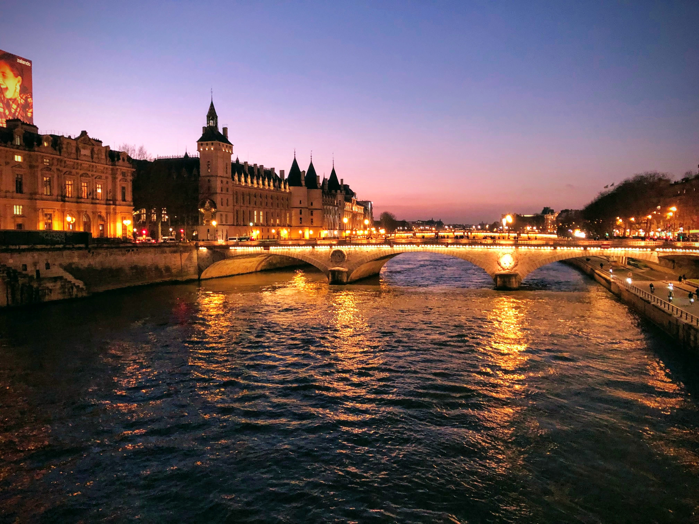
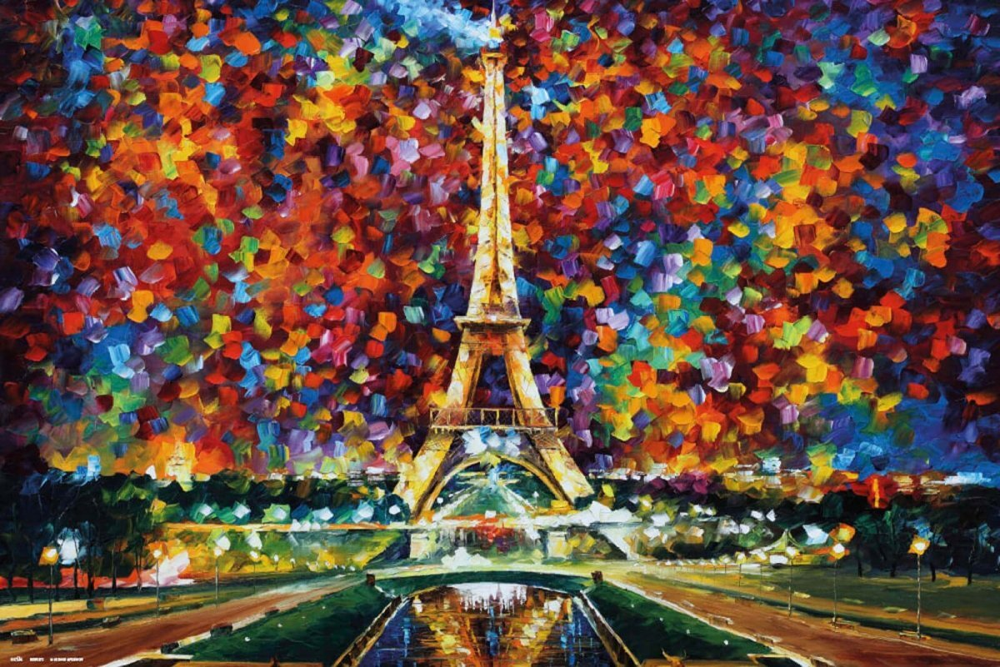
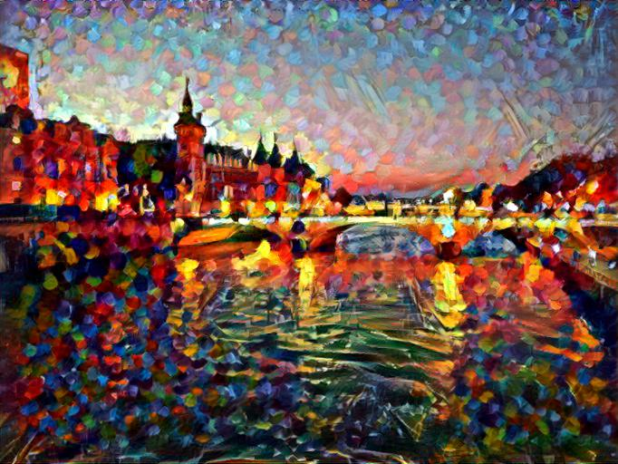
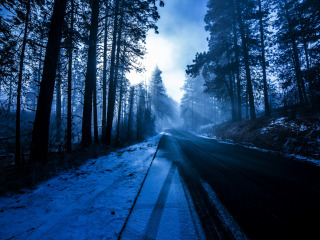
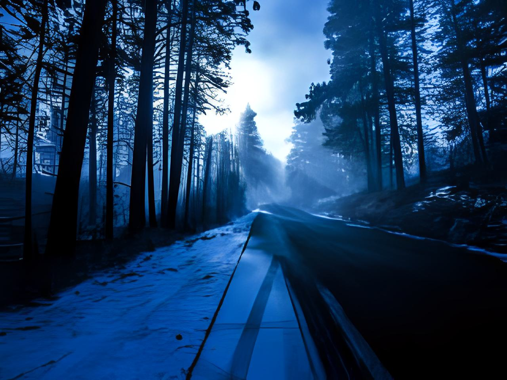

# NST_tgbot

Telegram бот для стилизации изображений и улучшения их качества.
В качестве алгоритма стилизации, используется алгоритм быстрого переноса стиля 
pytorch версия которого представлена [здесь](https://github.com/leongatys/PytorchNeuralStyleTransfer).

Для улучшения качества используется Real-ESRGAN pytorch версия которого представлена [здесь](https://github.com/ai-forever/Real-ESRGAN).

# Style image

# Image Upscale

# Начало работы с ботом 
https://t.me/NSTstylerbot
В начале работы присылается текстовое сообщение с описанием возможносетей бота.
Все управление происходит через кнопки. Для справки введите `/help`.

# Установка 
1) Добавьте TG_BOT_TOKEN="Your_tg_token" в переменные среды
2) Скачайте docker image с ботом [здесь](https://hub.docker.com/r/yagorka/tg_bot_nst)
3) Запустите docker run yagorka/tg_bot_nst

